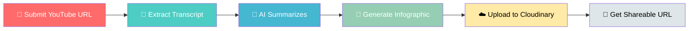

<p align="center">
  
</p>

<div align="center">

[](LICENSE)
[
[
[

### 🎯 Transform any YouTube video into a stunning infographic — automatically!

[🚀 Getting Started](#-getting-started) • [⚙️ How It Works](#-how-it-works) • [🛠 Tech Stack](#-tech-stack) • [📖 Usage](#-usage) • [🎨 Customization](#-customization)

---
</div>

<br>

> 💡 **One Workflow. One URL. Infinite Infographics.** Stop spending hours creating presentations. Let AI do the heavy lifting while you focus on what matters — sharing insights that matter.

<br>

---

## ✨ Why This Project?

<div align="center">

| ⚡ Speed | 🧠 AI Intelligence | 🎨 Design | ☁️ Cloud |
|----------|-------------------|-----------|----------|
| **60 seconds** from URL to infographic | Gemini understands content context | Professional layouts every time | Instant hosting & sharing |
| No manual work required | Smart summarization | Beautiful visuals | Public URL generation |

</div>

### 🎁 What You Get

```diff
+ ✅ Zero coding required — just import and run
+ ✅ Auto-transcribes any YouTube video
+ ✅ AI extracts key insights automatically
+ ✅ Generates professional infographics
+ ✅ Uploads to cloud — get your shareable link instantly
+ ✅ Built-in error handling — won't break on bad URLs
+ ✅ Fully customizable prompts — match your brand style
```

---

## 🔥 Features

<div align="left">

| Feature | What It Does |
|:---:|:---|
| 📥 **Smart Input** | Accepts any YouTube URL, validates format automatically |
| 📜 **Auto-Transcript** | Fetches transcripts via Apify — no copy-paste needed |
| 🧠 **AI Summarizer** | Gemini extracts main topics, key points, and insights |
| 🎨 **Infographic Gen** | Creates beautiful, shareable visuals automatically |
| ☁️ **Cloud Upload** | Uploads to Cloudinary — get your public URL in seconds |
| 🔗 **Share Anywhere** | Use the link in presentations, social media, docs |

</div>

---

## ⚙️ How It Works



### 🔄 Step-by-Step Process

| Step | Action | Who Does It |
|:---:|:---|:---:|
| **1** | User submits YouTube URL | 👤 You |
| **2** | Extract full video transcript | 🤖 Apify |
| **3** | Analyze & summarize content | 🧠 Gemini AI |
| **4** | Design infographic image | 🎨 Gemini AI |
| **5** | Upload image to cloud | ☁️ Cloudinary |
| **6** | Return shareable URL | 📤 n8n |

---

## 🛠 Tech Stack

<div align="center">

|  |  |  |  |
|:---:|:---:|:---:|:---:|
| **Workflow Automation** | **AI Content & Image Generation** | **YouTube Transcript Extraction** | **Image Hosting & CDN** |

</div>

---

## 📂 Project Structure

```text
ai-infographic-creator/
├── 📄 workflow.json       # The complete n8n workflow — import & run!
├── 📝 README.md           # This file — your guide to the project
├── 📁 screenshots/        # Visual documentation
│   ├── 🖼 workflow.png   # How the workflow looks in n8n
│   ├── 📝 form.png       # The input form users see
│   └── 🖼 output.png     # Example infographic output
└── 🚫 .gitignore         # Files to ignore in git
```

---

## 🚀 Getting Started

### Prerequisites

- [ ] **n8n** — Self-hosted or cloud instance
- [ ] **Google Gemini API Key** — With vision/image generation enabled
- [ ] **Apify Account** — With API token
- [ ] **Cloudinary Account** — Cloud name + API credentials

---

### Step 1: Import Workflow

```bash
1. Open your n8n instance
2. Go to: Workflows → Import from File
3. Select: workflow.json
4. Click: Import
```

### Step 2: Add Credentials

| Credential | Get It From |
|:---|:---|
| 🔑 **gemini-api** | [Google AI Studio](https://aistudio.google.com/app/apikey) |
| 🔑 **apify-api** | Apify → Settings → API Tokens |
| 🔑 **cloudinary** | Cloudinary → Dashboard → API Keys |

### Step 3: Activate & Use

```
✓ Toggle workflow to "Active"
✓ Copy the webhook URL
✓ Open in browser → paste YouTube link
✓ Hit submit → get your infographic URL!
```

---

## 📖 Usage

### Quick Demo

```
┌─────────────────────────────────────────┐
│  🎬 AI Infographic Creator              │
├─────────────────────────────────────────┤
│  YouTube URL: [Paste your link here]   │
│                                         │
│         [ 🚀 Generate Infographic ]     │
├─────────────────────────────────────────┤
│  Result: 📎 https://cloudinary.com/...  │
│  ⏱️ Time: ~45 seconds                    │
└─────────────────────────────────────────┘
```

### Processing Times

| Video Length | Estimated Time |
|:---:|:---:|
| < 10 min | ⚡ ~30 seconds |
| 10-30 min | ⏱️ ~45 seconds |
| 30+ min | 🐢 ~2 minutes |

---

## 🔧 API Setup (Detailed)

### 1️⃣ Google Gemini API

1. Go to [Google AI Studio](https://aistudio.google.com/app/apikey)
2. Click **Create API Key**
3. Copy the key
4. Add to n8n as `gemini-api` credential

> ⚠️ **Important:** Ensure Gemini Vision is enabled for image generation!

### 2️⃣ Apify

1. Sign up at [apify.com](https://apify.com)
2. Navigate to **Settings → API & Tokens**
3. Copy your **API Token**
4. Add to n8n as `apify-api` credential

### 3️⃣ Cloudinary

1. Create account at [cloudinary.com](https://cloudinary.com)
2. Note your **Cloud Name** (from Dashboard)
3. Go to **Settings → API Keys**
4. Copy **API Key** and **API Secret**
5. Add all three to n8n as `cloudinary` credential

---

## ⚠️ Error Handling

The workflow handles these gracefully:

| Error | What Happens |
|:---|:---|
| ❌ Invalid URL | Returns "Please enter a valid YouTube URL" |
| ❌ No Transcript | Returns "No transcript available for this video" |
| ❌ API Rate Limit | Retries automatically with backoff |
| ❌ Upload Failed | Returns error with Cloudinary message |
| ❌ AI Error | Shows Gemini error message |

---

## 🎨 Customization

### ✏️ Change the Infographic Style

Edit the **Gemini prompt** in the workflow to customize:

- 🎨 **Colors** — Your brand color palette
- 📐 **Layout** — Vertical, horizontal, grid
- 🔤 **Fonts** — Sans-serif, serif, monospace
- 📊 **Content** — More details or concise bullet points

### ➕ Extend It

Want more? Add support for:

```
📻 Podcast RSS feeds
📄 Article/URL summarization
🎥 Local video processing
🗣️ Audio transcription
📊 Multiple output formats
```

---

## 🤝 Contributing

<div align="left">

**We welcome contributions!**

- 🐛 Report bugs via GitHub Issues
- 💡 Suggest new features
- 🔀 Submit pull requests
- 📚 Improve documentation

</div>

---

## 🙏 Acknowledgments

<div align="left">

| Tool | Why We Love It |
|:---|:---|
| [n8n](https://n8n.io/) | Powerful, visual workflow automation |
| [Google Gemini](https://gemini.google.com/) | Incredible AI for understanding & creating |
| [Apify](https://apify.com/) | Rock-solid YouTube data extraction |
| [Cloudinary](https://cloudinary.com/) | Fast, reliable image hosting |

</div>

---

## 💬 Support

**Need help?** Here's where to look:

- 📋 **GitHub Issues** — Report bugs or request features
- 💬 **n8n Community** — Ask the community for help
- 📖 **workflow.json** — Read the actual workflow for details

---

<div align="center">

---

### 🌟 Like this project?

**Give it a star!** ⭐ → It helps others discover this tool.

---

Made with ❤️ | **n8n + AI**

---

</div>
